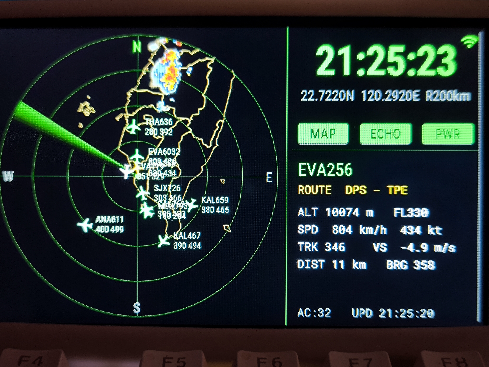

# ✈️ ESP32 Flight Radar

A desktop flight-radar ornament for the **ESP32-S3 5" 800×480 RGB touch panel**, built entirely with **ESPHome**. It shows live aircraft over your location on an ATC-style radar scope, and doubles as a weather-radar display, a Home Assistant panel, and an alarm clock.

> 一款以 **ESPHome** 打造的桌面航班雷達擺件,執行於 **ESP32-S3 5 吋 800×480 RGB 觸控屏**。以航管雷達風格顯示你所在位置上空的即時航班,同時也是氣象雷達顯示器、Home Assistant 控制面板與鬧鐘。

Inspired by [AnthonySturdy/micro-radar](https://github.com/AnthonySturdy/micro-radar) — reimagined for a large landscape touch display with a much larger feature set.

---

## 📸 Screenshot / 畫面



## 🎬 Demo video / 示範影片

[](https://youtu.be/3JHcLvoOxh8)

▶ **[Watch on YouTube / 在 YouTube 觀看](https://youtu.be/3JHcLvoOxh8)**


---

## English

### Features

- **Live flight radar** — pulls aircraft states from the [OpenSky Network](https://opensky-network.org/) around your coordinates and plots them on a 480×480 radar scope with a rotating sweep, fading trail, and target glow as the beam passes each aircraft.
- **ATC-style labels** — each aircraft shows its callsign, flight level and speed, with a heading-oriented plane icon. Tap any aircraft to see its **origin → destination** (via [adsbdb.com](https://www.adsbdb.com/)), altitude, speed, heading, vertical rate, distance and bearing.
- **Weather echo overlay** — optional rain-radar layer from [RainViewer](https://www.rainviewer.com/), downloaded, decoded and composited **entirely on a background core** so the UI never stutters. Toggle with an on-screen button.
- **Map outline overlay** — optional coastline / administrative border layer (Taiwan by default), toggle on screen.
- **Home Assistant integration** — the device auto-discovers in HA; backlight, Wi-Fi signal and buttons become HA entities.
- **Alarm clock** — up to 4 alarms, each with per-weekday scheduling. Alarms ring through a **Home Assistant media player** (any Wi-Fi speaker); **each alarm can ring on its own speaker** (e.g. weekday alarm in the bedroom, weekend alarm in the living room). On-screen **Snooze / Dismiss** overlay when ringing.
- **Fully on-device setup** — first boot opens a Wi-Fi captive portal. Coordinates, scan range, poll interval, OpenSky credentials and the alarm speaker can all be entered **on the touch screen** (or via the web page / Home Assistant). Everything is stored in NVS and survives reboots.
- **OTA updates** — after the first USB flash, all future updates are wireless.

### Hardware

| Part | Detail |
|------|--------|
| Board | ESP32-S3 5" RGB panel board (`esp32-s3-5inch-rgb-001`), 8 MB PSRAM (octal) + 16 MB flash |
| Panel | 800×480 IPS, ST7262 RGB driver |
| Touch | GT911 capacitive (I²C) |
| Power | USB-C |
| Enclosure | 3D-printable case ships with the board's SDK |

#### Compatible boards

The exact board is a generic **"esp32-s3-5inch-rgb-001"** panel sold on AliExpress/Taobao, but nothing in the firmware is vendor-specific. Any board that matches this combo should work after editing the pin map:

- **ESP32-S3** with **8 MB octal PSRAM** — required; quad-PSRAM boards cannot feed the RGB panel (the config runs PSRAM at 120 MHz octal)
- **800×480 parallel-RGB (DPI) display** — the `rpi_dpi_rgb` driver is used; SPI / QSPI / MIPI panels would need a different display platform
- **GT911** I²C touch controller (FT5x06 / CST8xx need a different `touchscreen` platform)
- **16 MB flash** — or change `flash_size` in `radar.yaml` (the firmware itself is ~1.4 MB)

Candidates include the Waveshare ESP32-S3-Touch-LCD-5, Sunton ESP32-8048S050 and Guition JC8048W550. To port: edit the backlight / I²C / RGB pins and the panel timings in the **Hardware pin map** section of `radar.yaml` to match your board's schematic. The UI layout is fixed at 800×480 landscape — other resolutions need a layout rework.

### Software requirements

- [ESPHome](https://esphome.io/) 2025.7 or newer (`pip install esphome`)
- The dependency `pngle` is pulled in automatically via `platformio_options`.

### Flashing

```bash
git clone https://github.com/delphicchen/esp32_flight_radar
cd esp32_flight_radar
esphome run radar.yaml
```

First flash must be over **USB** (`/dev/ttyUSB0` or `/dev/ttyACM0`; add yourself to the `dialout` group on Linux). If the upload stalls, hold **BOOT**, tap **RESET**, release **BOOT** to enter download mode. After that, `esphome run` updates over the air.

### First-time setup

1. On first boot the panel opens a Wi-Fi hotspot **`Radar-Setup`** (password `12345678`). Connect with your phone and pick your home Wi-Fi in the captive portal.
2. Register a **free OpenSky account**, then create an **API Client** in your account settings — this gives you a `client_id` and `client_secret` (OpenSky uses OAuth2, not your login password).
3. Tap the **Wi-Fi icon** (top right) or the **status line** to open the network / API page and enter your OpenSky credentials on screen. You can also fill them at `http://flight-radar.local` or in Home Assistant.
4. Tap the **coordinates line** to set your latitude / longitude and scan range on the numeric keypad.
5. Aircraft should appear within a minute. Toggle **MAP** / **ECHO** as you like.

### Alarm clock

- Tap the **clock** to open the alarm page (4 slots). For each: enable, tap the time to open a large scroll-wheel time picker, choose the weekdays, and (optionally) pick that alarm's own speaker from the dropdown at the end of its row.
- In the config fields set **Alarm Speaker** (a Home Assistant `media_player` entity, e.g. `media_player.living_room`) and optionally **Alarm Sound URL** (an mp3).
- In Home Assistant, open the device page and enable **"Allow the device to perform Home Assistant actions."** Otherwise the ESP32 cannot command the speaker.
- When an alarm fires, a **SNOOZE 9m / DISMISS** panel appears on screen. The sound **re-plays every 15 s until you press DISMISS**, so a short mp3 still keeps ringing.

#### Using a Google Nest / Chromecast speaker

1. Add the **Google Cast** integration in Home Assistant (it auto-discovers Nest/Cast devices on your LAN) → your speaker becomes a `media_player` entity.
2. In **Developer Tools → States** find its id (e.g. `media_player.nest_mini`) and put it in **Alarm Speaker**.
3. Cast devices only play a **full, reachable URL**. Put an mp3 in Home Assistant's `config/www/` and use `http://<HA-IP>:8123/local/alarm.mp3` (use the IP, not `homeassistant.local`).
4. Test first in **Developer Tools → Actions**: `media_player.play_media` with your entity and URL. If the speaker rings, the alarm will too.

#### Speaker auto-discovery (SCAN button)

Instead of typing the entity id by hand, the alarm page can list every `media_player` in your Home Assistant. One-time setup:

1. In Home Assistant open your **profile (bottom-left avatar) → Security → Long-lived access tokens → Create token**. Copy it — it is shown only once.
2. Open the device's web page at `http://flight-radar.local` (or the device page in HA) and paste the token into **HA Token**. **HA URL** can stay empty — it defaults to `http://homeassistant.local:8123`; if the scan later reports `HA UNREACHABLE`, set it to your HA address by IP instead (e.g. `http://192.168.1.10:8123` — mDNS name resolution is unreliable on some networks). Both fields are saved to flash and survive reboots.
3. Open the alarm page — it **scans automatically** on entry once the token is set (or press **SCAN** in the top bar). All speaker dropdowns fill with friendly names: the **DEF** dropdown in the top bar is the default speaker (used by any alarm without its own), and each alarm row ends with that alarm's own dropdown. Picking a speaker saves immediately. Manual entry still works too (entities **Alarm Speaker** and **Alarm 1–4 Speaker**; leave an alarm's entry empty to use the default).

Troubleshooting: `SET HA TOKEN FIRST` = step 2 not done yet; `TOKEN INVALID` = the token is wrong or was revoked; `HA UNREACHABLE` = wrong HA URL / use the IP; `NO SPEAKERS FOUND` = HA has no `media_player` entities (add the Google Cast / Sonos / etc. integration first).

> **Security note:** a long-lived token grants full access to your Home Assistant and is stored in the device's flash. Treat it like a password and keep the device on a trusted network — the firmware only uses it for this read-only speaker query.

### Configuration reference

All of these are Home Assistant / web entities, stored in NVS:

| Setting | Meaning |
|---------|---------|
| OpenSky Client ID / Secret | OAuth2 API client credentials |
| Home Latitude / Longitude | Radar center (your location) |
| Radar Range | Scan radius in km (10–500) |
| Poll Interval | Seconds between fetches (default 30 → 2880/day, within the 4000/day quota) |
| HA URL | Home Assistant address for speaker scan (empty = `http://homeassistant.local:8123`) |
| HA Token | HA long-lived access token used by the SCAN button |
| Alarm Speaker | Default HA `media_player` entity to ring through (type it or use SCAN) |
| Alarm 1–4 Speaker | Per-alarm speaker override; empty = use Alarm Speaker |
| Alarm Sound URL | mp3 to play when an alarm fires |

### Using it outside Taiwan

The repo ships with a Taiwan outline in `map_data.h`, but the radar projection itself is fully generic — just regenerate the map for your own location before compiling:

```bash
# Tokyo, up to 150 km range
python tools/make_map.py --lat 35.6762 --lon 139.6503 --radius 150

# London, 300 km, with state/province borders
python tools/make_map.py --lat 51.5074 --lon -0.1278 --radius 300 --states
```

The script (pure Python, no packages needed) downloads [Natural Earth](https://www.naturalearthdata.com/) 1:10m coastline + country border data (public domain, cached in `tools/cache/`), clips it around your coordinates, simplifies it to roughly one radar pixel of detail, and overwrites `map_data.h`. Set `--radius` to the largest radar range you plan to use. Useful options: `--states` adds admin-1 borders (can be dense in some countries), `--geojson file.geojson` uses your own boundary file instead of downloading, `--tol` / `--max-points` control detail.

### Data sources & credits

- Aircraft states — [OpenSky Network](https://opensky-network.org/)
- Route lookup — [adsbdb.com](https://www.adsbdb.com/)
- Weather radar — [RainViewer](https://www.rainviewer.com/)
- Local weather — [Open-Meteo](https://open-meteo.com/)
- Taiwan boundaries — [g0v/twgeojson](https://github.com/g0v/twgeojson)
- World map data — [Natural Earth](https://www.naturalearthdata.com/) (public domain)
- Concept — [AnthonySturdy/micro-radar](https://github.com/AnthonySturdy/micro-radar)

Please respect each provider's free-tier terms; this project is a hobby build, not a service.

---

## 中文

### 功能

- **即時航班雷達** — 從 [OpenSky Network](https://opensky-network.org/) 取得你座標周圍的航班,繪製在 480×480 雷達盤上,附旋轉掃描線、漸暗餘暉,以及掃描線掃過飛機時的高亮效果。
- **航管風格標籤** — 每架飛機顯示呼號、飛航高度層與速度,搭配依航向旋轉的飛機圖示。點選任一飛機可查看**起點 → 目的地**(透過 [adsbdb.com](https://www.adsbdb.com/))、高度、速度、航向、垂直速率、距離與方位。
- **氣象回波圖層** — 可選的降雨雷達層,資料來自 [RainViewer](https://www.rainviewer.com/);下載、解碼、合成**全部在背景核心完成**,主畫面完全不卡。以螢幕按鈕開關。
- **地圖輪廓圖層** — 可選的海岸線 / 行政區界(預設台灣),螢幕按鈕開關。
- **Home Assistant 整合** — 裝置會自動被 HA 探索;背光、Wi-Fi 訊號與按鈕都成為 HA 實體。
- **鬧鐘** — 最多 4 組,每組可設定特定星期幾。鬧鐘透過 **Home Assistant 的媒體播放器**(任何 Wi-Fi 喇叭)發聲,且**每組鬧鐘可指定不同喇叭**(例如平日鬧鐘在臥室響、週末鬧鐘在客廳響)。響鈴時螢幕出現**貪睡 / 關閉**面板。
- **完全在裝置上設定** — 首次開機開啟 Wi-Fi 設定熱點。座標、掃描半徑、輪詢間隔、OpenSky 憑證、鬧鐘喇叭都可以**直接在觸控螢幕上輸入**(也可透過網頁 / Home Assistant)。全部存於 NVS,重開機保留。
- **OTA 無線更新** — 第一次用 USB 燒錄後,之後都能無線更新。

### 硬體

| 零件 | 說明 |
|------|------|
| 主板 | ESP32-S3 5 吋 RGB 屏方案板(`esp32-s3-5inch-rgb-001`),8 MB PSRAM(octal)+ 16 MB flash |
| 面板 | 800×480 IPS,ST7262 RGB 驅動 |
| 觸控 | GT911 電容式(I²C) |
| 供電 | USB-C |
| 外殼 | 方案板 SDK 附 3D 列印外殼檔 |

#### 相容板子

本專案用的是淘寶/AliExpress 常見的白牌 **「esp32-s3-5inch-rgb-001」** 方案板,但韌體沒有綁定任何廠商。符合以下組合的板子改腳位後都能用:

- **ESP32-S3 + 8 MB octal PSRAM** — 必要;quad PSRAM 頻寬餵不動 RGB 屏(設定跑 120 MHz octal)
- **800×480 平行 RGB(DPI)螢幕** — 使用 `rpi_dpi_rgb` 驅動;SPI / QSPI / MIPI 屏需要換 display 平台
- **GT911** I²C 觸控(FT5x06 / CST8xx 要換 `touchscreen` 平台)
- **16 MB flash** — 或修改 `radar.yaml` 的 `flash_size`(韌體本身約 1.4 MB)

可行的例子:Waveshare ESP32-S3-Touch-LCD-5、Sunton ESP32-8048S050、Guition JC8048W550。移植方式:照你板子的原理圖修改 `radar.yaml` 中 **Hardware pin map** 區的背光 / I²C / RGB 腳位與面板時序即可。UI 版面寫死 800×480 橫向,其他解析度需要重排版面。

### 軟體需求

- [ESPHome](https://esphome.io/) 2025.7 以上(`pip install esphome`)
- 相依的 `pngle` 會由 `platformio_options` 自動安裝。

### 燒錄

```bash
git clone https://github.com/delphicchen/esp32_flight_radar
cd esp32_flight_radar
esphome run radar.yaml
```

第一次必須用 **USB** 燒錄(`/dev/ttyUSB0` 或 `/dev/ttyACM0`;Linux 上把自己加入 `dialout` 群組)。若燒錄卡住,按住 **BOOT**、點一下 **RESET**、放開 **BOOT** 進入下載模式。之後 `esphome run` 就能走 OTA 無線更新。

### 首次設定

1. 首次開機面板會開啟 Wi-Fi 熱點 **`Radar-Setup`**(密碼 `12345678`)。用手機連上,在跳出的設定頁選擇你家的 Wi-Fi。
2. 註冊**免費的 OpenSky 帳號**,到帳號設定裡建立一個 **API Client**,取得 `client_id` 與 `client_secret`(OpenSky 使用 OAuth2,不是用你的登入密碼)。
3. 點螢幕右上角的 **Wi-Fi 圖示**或**底部狀態列**開啟網路 / API 設定頁,在螢幕上輸入 OpenSky 憑證。也可以在 `http://flight-radar.local` 或 Home Assistant 填寫。
4. 點**座標列**用數字鍵盤設定你的經緯度與掃描半徑。
5. 約一分鐘內飛機就會出現。依喜好切換 **MAP** / **ECHO**。

### 鬧鐘

- 點**時鐘**開啟鬧鐘頁(4 組)。每組:啟用、點時間彈出大型捲輪選擇器設定時 / 分、選擇星期幾,列尾的下拉選單可(選擇性)指定該組專屬喇叭。
- 在設定欄位填入 **Alarm Speaker**(Home Assistant 的 `media_player` 實體,例如 `media_player.living_room`),以及可選的 **Alarm Sound URL**(mp3)。
- 在 Home Assistant 的裝置頁開啟「**允許此裝置執行 Home Assistant 動作**」,否則 ESP32 無法命令喇叭。
- 鬧鐘響時,螢幕會出現 **SNOOZE 9m / DISMISS** 面板。聲音會**每 15 秒重播一次,直到你按下 DISMISS**,所以短音檔也能持續響。

#### 使用 Google Nest / Chromecast 喇叭

1. 在 Home Assistant 新增 **Google Cast** 整合(會自動發現區網內的 Nest / Cast 裝置)→ 喇叭變成一個 `media_player` 實體。
2. 到 **開發者工具 → 狀態** 找出它的 id(例如 `media_player.nest_mini`),填進 **Alarm Speaker**。
3. Cast 裝置只吃**完整、連得到的 URL**。把 mp3 放到 HA 的 `config/www/`,網址用 `http://<HA的IP>:8123/local/alarm.mp3`(用 IP,不要用 `homeassistant.local`)。
4. 先在 **開發者工具 → 動作** 用 `media_player.play_media` 帶入你的實體與網址測試;喇叭有響,鬧鐘就會響。

#### 自動搜尋喇叭(SCAN 鈕)

不必手打 entity id,鬧鐘頁可以直接列出 HA 裡所有的 `media_player`。一次性設定:

1. 在 Home Assistant 開啟**個人資料(左下角頭像)→ 安全性 → 長期存取權杖 → 建立權杖**,複製起來——它只會顯示這一次。
2. 開啟裝置網頁 `http://flight-radar.local`(或 HA 的裝置頁),把權杖貼進 **HA Token**。**HA URL** 可以留空——預設 `http://homeassistant.local:8123`;若之後掃描顯示 `HA UNREACHABLE`,請改填 HA 的 IP(如 `http://192.168.1.10:8123`,mDNS 名稱解析在部分網路不可靠)。兩個欄位都會存進 flash,重開機不會消失。
3. 開啟鬧鐘頁——權杖填好後**進頁會自動掃描**(也可按頂列的 **SCAN**)。所有喇叭下拉選單會列出友善名稱:頂列 **DEF** 選單是預設喇叭(沒有專屬喇叭的鬧鐘用它),每組鬧鐘列尾則是該組的專屬選單。挑了就立即存檔。仍然可以手動填寫(實體 **Alarm Speaker** 與 **Alarm 1–4 Speaker**;某組留空 = 用預設)。

疑難排解:`SET HA TOKEN FIRST` = 還沒做第 2 步;`TOKEN INVALID` = 權杖錯誤或已撤銷;`HA UNREACHABLE` = HA URL 不對,改用 IP;`NO SPEAKERS FOUND` = HA 裡沒有任何 `media_player` 實體(先新增 Google Cast / Sonos 等整合)。

> **安全性提醒:**長期權杖等同 HA 的完整存取權,且儲存在裝置 flash 中。請把它當密碼看待、讓裝置留在信任的內網;韌體只會用它做這個唯讀的喇叭查詢。

### 設定項一覽

以下皆為 Home Assistant / 網頁實體,存於 NVS:

| 設定 | 意義 |
|------|------|
| OpenSky Client ID / Secret | OAuth2 API 憑證 |
| Home Latitude / Longitude | 雷達中心(你的位置) |
| Radar Range | 掃描半徑(公里,10–500) |
| Poll Interval | 抓取間隔秒數(預設 30 → 每日 2880 次,在 4000 次/日額度內) |
| HA URL | 喇叭掃描用的 HA 位址(留空 = `http://homeassistant.local:8123`) |
| HA Token | SCAN 鈕使用的 HA 長期存取權杖 |
| Alarm Speaker | 預設發聲的 HA `media_player` 實體(手填或用 SCAN 選) |
| Alarm 1–4 Speaker | 各組鬧鐘的專屬喇叭;留空 = 用 Alarm Speaker |
| Alarm Sound URL | 鬧鐘響時播放的 mp3 |

### 在台灣以外地區使用

repo 內附的 `map_data.h` 是台灣輪廓,但雷達投影本身完全通用——編譯前為你的位置重新產生地圖即可:

```bash
# 東京,最大半徑 150 km
python tools/make_map.py --lat 35.6762 --lon 139.6503 --radius 150

# 倫敦,300 km,加省/州界
python tools/make_map.py --lat 51.5074 --lon -0.1278 --radius 300 --states
```

腳本(純 Python,免裝套件)會下載 [Natural Earth](https://www.naturalearthdata.com/) 1:10m 海岸線+國界資料(public domain,快取於 `tools/cache/`),裁切你座標周圍的範圍、簡化到約一個雷達像素的細節,然後覆寫 `map_data.h`。`--radius` 請設為你會用到的最大雷達半徑。常用選項:`--states` 加省/州界(部分國家會很密)、`--geojson file.geojson` 改用自備邊界檔不下載、`--tol` / `--max-points` 調細節。

### 資料來源與致謝

- 航班狀態 — [OpenSky Network](https://opensky-network.org/)
- 航線查詢 — [adsbdb.com](https://www.adsbdb.com/)
- 氣象雷達 — [RainViewer](https://www.rainviewer.com/)
- 在地天氣 — [Open-Meteo](https://open-meteo.com/)
- 台灣界線 — [g0v/twgeojson](https://github.com/g0v/twgeojson)
- 世界地圖資料 — [Natural Earth](https://www.naturalearthdata.com/)(public domain)
- 概念啟發 — [AnthonySturdy/micro-radar](https://github.com/AnthonySturdy/micro-radar)

請遵守各資料來源的免費方案條款;本專案是自用興趣作品,並非商業服務。

---

## 🔗 Links / 友链

- 非常感谢 [LINUX DO](https://linux.do/latest) 社区提供的交流平台 / Many thanks to the LINUX DO community for the great discussion platform.

---

## 📄 License / 授權

**Creative Commons Attribution-NonCommercial-ShareAlike 4.0 International (CC BY-NC-SA 4.0)**

You are free to **use, share and adapt** this project for **non-commercial purposes**, as long as you give appropriate credit and license your derivatives under the same terms. **Commercial use is not permitted.** See [`LICENSE`](LICENSE).

你可以基於**非商業目的**自由**使用、分享與改作**本專案,前提是註明出處並以相同條款授權你的衍生作品。**不允許商業使用。** 詳見 [`LICENSE`](LICENSE)。

© 2026 delphicchen
