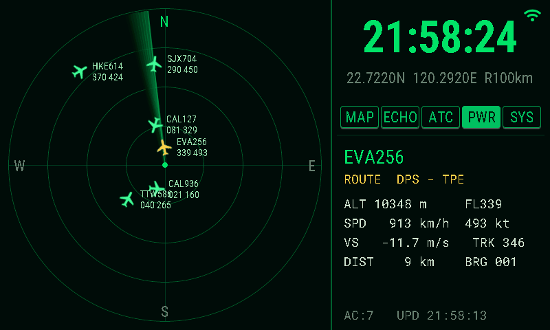

# ✈️ ESP32 Flight Radar

A desktop flight-radar ornament for the **ESP32-S3 5" 800×480 RGB touch panel**, built entirely with **ESPHome**. It shows live aircraft over your location on an ATC-style radar scope, and doubles as a weather-radar display, a Home Assistant panel, and an alarm clock.

> 一款以 **ESPHome** 打造的桌面航班雷達擺件,執行於 **ESP32-S3 5 吋 800×480 RGB 觸控屏**。以航管雷達風格顯示你所在位置上空的即時航班,同時也是氣象雷達顯示器、Home Assistant 控制面板與鬧鐘。

Inspired by [AnthonySturdy/micro-radar](https://github.com/AnthonySturdy/micro-radar) — reimagined for a large landscape touch display with a much larger feature set.

---

## 📸 Demo / 畫面



## 🎬 Demo video / 示範影片

▶ **[Watch the full demo video / 觀看完整示範影片](docs/demo.mp4)**


---

## English

### Features

- **Live flight radar** — pulls aircraft states from the [OpenSky Network](https://opensky-network.org/), [airplanes.live](https://airplanes.live/) or [adsb.lol](https://adsb.lol/) around your coordinates and plots them on a 480×480 radar scope with a rotating sweep, fading trail, and target glow as the beam passes each aircraft.
- **Selectable data source + automatic fallback** — a **SRC** selector on the settings page picks OpenSky (OAuth2, 4,000 credits/day) or the free no-key **airplanes.live** / **adsb.lol** APIs, each with its own poll interval (**POLL2**, 5–300 s). If an OpenSky fetch fails (bad credentials, quota exhausted, outage) the device automatically falls back to the free sources for 10 minutes, then retries OpenSky; the status line and SYS panel show which source is active.
- **ATC-style labels** — each aircraft shows its callsign, flight level and speed, with a heading-oriented plane icon. Tap any aircraft to see its **origin → destination** (via [adsbdb.com](https://www.adsbdb.com/)), altitude, speed, heading, vertical rate, distance and bearing.
- **ATC mode** — toggle button switches the plane icons to bare **target squares** with a **2‑minute velocity vector**, a **dotted fading history trail**, and a local **STCA-style conflict alert** (two aircraft within 5.5 km / 300 m get flagged red); stale data (no update for 60 s) is flagged yellow with a `*` suffix. Turn it off to instantly restore the normal plane-icon view.
- **Weather echo overlay** — optional rain-radar layer from [RainViewer](https://www.rainviewer.com/), downloaded, decoded and composited **entirely on a background core** so the UI never stutters. Toggle with an on-screen button.
- **Map outline overlay** — optional coastline / administrative border layer (Taiwan by default), toggle on screen.
- **Home Assistant integration** — the device auto-discovers in HA; backlight, Wi-Fi signal and buttons become HA entities.
- **Alarm clock** — up to 4 alarms, each with per-weekday scheduling. Alarms ring through a **Home Assistant media player** (any Wi-Fi speaker); **each alarm can ring on its own speaker** (e.g. weekday alarm in the bedroom, weekend alarm in the living room). On-screen **Snooze / Dismiss** overlay when ringing.
- **Fully on-device setup** — first boot opens a Wi-Fi captive portal. Coordinates, scan range, poll interval, OpenSky credentials and the alarm speaker can all be entered **on the touch screen** (or via the web page / Home Assistant). A **timezone** dropdown (alarm page) and a **metric/imperial units** toggle (settings page — switches °C/°F, km·h/mph, km/mi, m/ft and the range unit) are set on screen too. Everything is stored in NVS and survives reboots.
- **OTA updates** — after the first USB flash, all future updates are wireless.

### Hardware

| Part | Detail |
|------|--------|
| Board | ESP32-S3 5" RGB panel board (`esp32-s3-5inch-rgb-001`), 8 MB PSRAM (octal) + 16 MB flash |
| Panel | 800×480 IPS, ST7262 RGB driver |
| Touch | GT911 capacitive (I²C) |
| Power | USB-C |
| Enclosure | 3D-printable case ships with the board's SDK |

#### Supported boards & project structure

The firmware is split into **reusable packages** so a new display board is just a
new board file plus a matching layout — the shared logic never changes:

```
radar.yaml            entry: ESP32-S3 + 800×480 RGB   (the original board)
radar-s3-5b.yaml      entry: Waveshare ESP32-S3-Touch-LCD-5B  (1024×600 RGB)
radar-p4-7b.yaml      entry: Waveshare ESP32-P4-WIFI6-Touch-LCD-7B (1024×600 MIPI-DSI)
common/core.yaml      shared logic + UI-independent components (fonts, scripts, …)
boards/*.yaml         per-board hardware: MCU / PSRAM / display / touch / backlight
ui/ui_800x480.yaml    LVGL layout at 800×480
ui/ui_1024x600.yaml   LVGL layout at 1024×600  (auto-scaled from the 800×480 source)
```

Each entry file just picks a resolution (via `substitutions`) and a `board` + `ui`
package. Screen size flows into the fonts, the display driver and the C++ helpers
(through `build_flags` → `radar_fetch.h` macros), so there are no hard-coded
dimensions left to chase.

| Entry | Board | MCU | Panel | Wi-Fi | Status |
|-------|-------|-----|-------|-------|--------|
| `radar.yaml` | esp32-s3-5inch-rgb-001 (generic) | ESP32-S3 | 800×480 parallel-RGB (ST7262) | native | **verified on hardware** |
| `radar-s3-5b.yaml` | Waveshare ESP32-S3-Touch-LCD-5B | ESP32-S3 | 1024×600 parallel-RGB | native | config-validated, **verify pins/timings on device** |
| `radar-p4-7b.yaml` | Waveshare ESP32-P4-WIFI6-Touch-LCD-7B | ESP32-P4 | 1024×600 MIPI-DSI (EK79007) | ESP32-C6 (esp-hosted/SDIO) | config-validated, **verify pins on device** |

Common requirements for the RGB boards: **≥8 MB octal PSRAM** (quad-PSRAM can't feed
the RGB panel), a **GT911** I²C touch controller, and 16 MB flash (`flash_size` is set
per board). Other generic 800×480 RGB+GT911 boards (Sunton ESP32-8048S050, Guition
JC8048W550, …) work with `radar.yaml` after matching the pins in
`boards/esp32s3_rgb_800x480.yaml`.

**Adding a board:** drop a new file in `boards/`, set its pins/driver, then copy an
entry file and point `board:`/`ui:` at it. For a new resolution, regenerate a layout
with `python3 tools/scale_layout.py ui/ui_800x480.yaml ui/ui_<w>x<h>.yaml <factor>`
and set `radar_canvas`/font sizes to match.

> **The two new boards are validated with `esphome config` but have not yet been
> flashed by the author.** The pin maps come from the published Waveshare wiring and
> ESPHome's built-in panel models; the 1024×600 layout is the 800×480 UI scaled ×1.25
> as a starting point. Cross-check the pins/timings marked `verify` in the board files
> against your unit, and fine-tune the layout on screen. On the ESP32-P4 the parallel-RGB
> framebuffer screenshot is compiled out (MIPI-DSI has no equivalent grab); every other
> feature is shared.

### Software requirements

- **[ESPHome](https://esphome.io/) 2026.3.x is recommended** (`pip install esphome==2026.3.*`). The firmware calls the LVGL **v8** canvas draw API directly, so it does **not** build on 2026.4.0+ (which switched to LVGL v9) — see issue #5. The 1024×600 boards additionally need the `mipi_rgb` / `mipi_dsi` drivers added in 2025.9.0, so their working range is **2025.9 – 2026.3** (2026.3.x covers all three boards). The original 800×480 `radar.yaml` works on any ≤ 2026.3.x.
- The dependency `pngle` is pulled in automatically via `platformio_options`.

### Flashing

```bash
git clone https://github.com/delphicchen/esp32_flight_radar
cd esp32_flight_radar
esphome run radar.yaml          # ESP32-S3 800×480 (original board)
# or, for the newer panels:
# esphome run radar-s3-5b.yaml  # Waveshare ESP32-S3-Touch-LCD-5B  (1024×600)
# esphome run radar-p4-7b.yaml  # Waveshare ESP32-P4-WIFI6-Touch-LCD-7B (1024×600)
```

First flash must be over **USB** (`/dev/ttyUSB0` or `/dev/ttyACM0`; add yourself to the `dialout` group on Linux). If the upload stalls, hold **BOOT**, tap **RESET**, release **BOOT** to enter download mode. After that, `esphome run` updates over the air.

### First-time setup

1. On first boot the panel opens a Wi-Fi hotspot **`Radar-Setup`** (password `12345678`). Connect with your phone and pick your home Wi-Fi in the captive portal.
2. *(Only needed for the OpenSky source)* Register a **free OpenSky account**, then create an **API Client** in your account settings — this gives you a `client_id` and `client_secret` (OpenSky uses OAuth2, not your login password). If you pick **airplanes.live** or **adsb.lol** as the source instead, no account or key is required at all.
3. Tap the **Wi-Fi icon** (top right) or the **status line** to open the network / API page and enter your OpenSky credentials on screen. You can also fill them at `http://flight-radar.local` or in Home Assistant.
4. Tap the **coordinates line** to set your latitude / longitude, scan range and OpenSky poll interval on the numeric keypad; the **SRC** row picks the data source (OPENSKY / A.LIVE / ADSB.LOL) and **POLL2** sets the poll interval used with the free sources; a checkbox chooses whether fetching **continues while the backlight is off** (default: paused). With OpenSky selected the page shows a live estimate of the resulting **daily API credit usage** (green / amber / red against the free 4,000-credit quota; cost per fetch grows with range); the free sources have no daily quota but cap the radius at 250 NM (≈463 km).
5. Aircraft should appear within a minute. Toggle **MAP** / **ECHO** as you like.

### Alarm clock

- Tap the **clock** to open the alarm page (4 slots). For each: enable, tap the time to open a large scroll-wheel time picker, choose the weekdays, and (optionally) pick that alarm's own speaker from the dropdown at the end of its row.
- In the config fields set **Alarm Speaker** (a Home Assistant `media_player` entity, e.g. `media_player.living_room`) and optionally **Alarm Sound URL** (an mp3).
- In Home Assistant, open the device page and enable **"Allow the device to perform Home Assistant actions."** Otherwise the ESP32 cannot command the speaker.
- When an alarm fires, a **SNOOZE 9m / DISMISS** panel appears on screen. The sound **re-plays every 15 s until you press DISMISS**, so a short mp3 still keeps ringing.

#### Using a Google Nest / Chromecast speaker

1. Add the **Google Cast** integration in Home Assistant (it auto-discovers Nest/Cast devices on your LAN) → your speaker becomes a `media_player` entity.
2. In **Developer Tools → States** find its id (e.g. `media_player.nest_mini`) and put it in **Alarm Speaker**.
3. Cast devices only play a **full, reachable URL**. Put an mp3 in Home Assistant's `config/www/` and use `http://<HA-IP>:8123/local/alarm.mp3` (use the IP, not `homeassistant.local`).
4. Test first in **Developer Tools → Actions**: `media_player.play_media` with your entity and URL. If the speaker rings, the alarm will too.

#### Speaker auto-discovery (SCAN button)

Instead of typing the entity id by hand, the alarm page can list every `media_player` in your Home Assistant. One-time setup:

1. In Home Assistant open your **profile (bottom-left avatar) → Security → Long-lived access tokens → Create token**. Copy it — it is shown only once.
2. Open the device's web page at `http://flight-radar.local` (or the device page in HA) and paste the token into **HA Token**. **HA URL** can stay empty — it defaults to `http://homeassistant.local:8123`; if the scan later reports `HA UNREACHABLE`, set it to your HA address by IP instead (e.g. `http://192.168.1.10:8123` — mDNS name resolution is unreliable on some networks). Both fields are saved to flash and survive reboots.
3. Open the alarm page — it **scans automatically** on entry once the token is set (or press **SCAN** in the top bar). All speaker dropdowns fill with friendly names: the **DEF** dropdown in the top bar is the default speaker (used by any alarm without its own), and each alarm row ends with that alarm's own dropdown. Picking a speaker saves immediately. Manual entry still works too (entities **Alarm Speaker** and **Alarm 1–4 Speaker**; leave an alarm's entry empty to use the default).

Troubleshooting: `SET HA TOKEN FIRST` = step 2 not done yet; `TOKEN INVALID` = the token is wrong or was revoked; `HA UNREACHABLE` = wrong HA URL / use the IP; `NO SPEAKERS FOUND` = HA has no `media_player` entities (add the Google Cast / Sonos / etc. integration first).

> **Security note:** a long-lived token grants full access to your Home Assistant and is stored in the device's flash. Treat it like a password and keep the device on a trusted network — the firmware only uses it for this read-only speaker query.

### ATC mode

Press the **ATC** button (in the top-right button row, between **ECHO** and **PWR**) to switch the radar from plane icons to an air-traffic-control style view; press again to instantly restore the default view.

- Each aircraft becomes a small **green target square**. Tap it exactly like the plane icon to select/deselect (same `select_slot` behavior).
- A thin line projects each aircraft's **position 2 minutes ahead** based on its current heading and ground speed.
- A **dotted fading trail** follows behind, through its last few fetched positions (dots, so it can't be confused with the solid vector line).
- Labels switch to two lines: callsign on top, `FL<flight level><climb arrow><speed>kts` below (`↑` climbing, `↓` descending, `=` level); the label auto-flips to the other side of the target when the velocity vector would run through it.
- **Conflict alert (red):** any two aircraft within **5.5 km** horizontally *and* **300 m** vertically both turn red; if one of them is the selected aircraft it blinks white/red instead of solid white.
- **Stale data (yellow):** if the data source hasn't updated an aircraft in over 60 s, its label turns yellow and gets a trailing `*`.
- Selected aircraft (no conflict) stay white.
- **Static video map:** ATC mode also bakes the `map_data.h` overlays into the base layer — airspace boundaries (CTR-class zones brighter blue, TMA/CTA dimmer), runways with **dashed extended centerlines**, airport squares with ICAO codes, and navaid/fix triangles with names. All of it disappears when ATC mode is switched off.
- **Layer panel:** the **SYS** button has two amber tabs — **SYSTEM** (hardware info + remaining OpenSky API quota, or the active free source when on airplanes.live / adsb.lol) and **ATC CONF**, where four toggles (**AIRSPACE / RUNWAY / AIRPORT / FIXES**) choose which map layers to draw (saved to NVS). The idle bottom-right panel keeps showing the local weather as usual.
- **Route line (ROUTE):** a fifth toggle in **ATC CONF**. When on, each label grows a third line with the flight's **origin–destination** (e.g. `KHH-KIX`), looked up per aircraft from [adsbdb.com](https://www.adsbdb.com/) in the background and cached, so each callsign is fetched only once. Lines appear as lookups complete (a few seconds); flights unknown to adsbdb simply show no third line. Saved to NVS like the other layer toggles.

### Screenshots to Home Assistant

Swipe **three fingers downward** anywhere on the screen to take a screenshot. The device snapshots the framebuffer, serves it at `http://flight-radar.local:8081/screenshot.bmp` (800×480 BMP) and fires the HA event `esphome.flight_radar_screenshot`. To save it automatically, add the **Downloader** integration in HA (set its directory, e.g. `/config/downloads`) and an automation:

```yaml
automation:
  - alias: Save flight radar screenshot
    trigger:
      - platform: event
        event_type: esphome.flight_radar_screenshot
    action:
      - service: downloader.download_file
        data:
          url: "http://flight-radar.local:8081/screenshot.bmp"
          filename: "radar_{{ now().strftime('%Y%m%d_%H%M%S') }}.bmp"
```

You can also just open the URL in a browser. If the colors come out wrong (red/blue swapped), set `SHOT_SWAP_BYTES` to `1` in `radar_fetch.h` and re-flash.

### Configuration reference

All of these are Home Assistant / web entities, stored in NVS:

| Setting | Meaning |
|---------|---------|
| OpenSky Client ID / Secret | OAuth2 API client credentials |
| Home Latitude / Longitude | Radar center (your location) |
| Radar Range | Scan radius in km (10–500) |
| Poll Interval | Seconds between OpenSky fetches (default 30 → 2880/day, within the 4000/day quota) |
| Poll Interval Alt | Seconds between fetches on the free sources (airplanes.live / adsb.lol, 5–300, default 15) |
| HA URL | Home Assistant address for speaker scan (empty = `http://homeassistant.local:8123`) |
| HA Token | HA long-lived access token used by the SCAN button |
| Alarm Speaker | Default HA `media_player` entity to ring through (type it or use SCAN) |
| Alarm 1–4 Speaker | Per-alarm speaker override; empty = use Alarm Speaker |
| Alarm Sound URL | mp3 to play when an alarm fires |

### Using it outside Taiwan

The repo ships with a Taiwan outline in `map_data.h`, but the radar projection itself is fully generic — just regenerate the map for your own location before compiling:

```bash
# Tokyo, up to 150 km range
python tools/make_map.py --lat 35.6762 --lon 139.6503 --radius 150

# London, 300 km, with state/province borders
python tools/make_map.py --lat 51.5074 --lon -0.1278 --radius 300 --states
```

The script (pure Python, no packages needed) downloads [Natural Earth](https://www.naturalearthdata.com/) 1:10m coastline + country border data (public domain, cached in `tools/cache/`), clips it around your coordinates, simplifies it to roughly one radar pixel of detail, and overwrites `map_data.h`. Set `--radius` to the largest radar range you plan to use. Useful options: `--states` adds admin-1 borders (can be dense in some countries), `--geojson file.geojson` uses your own boundary file instead of downloading, `--tol` / `--max-points` control detail.

The script also generates **ATC overlay data** (`AIRPORTS[]`, `RUNWAYS[]`, `FIXES[]`, `AIRSPACES[]`) into the same `map_data.h`. A complete run that produces everything at once:

```bash
# Taipei, 200 km: outline + airports & runways + navaids + 5-letter fixes + CTR/TMA airspaces
python tools/make_map.py --lat 25.03 --lon 121.56 --radius 200 \
    --countries TW --min-airport small --rwy-ext 15 \
    --fixes-csv my_fixes.csv --openaip-key YOURKEY
```

| Flag | What it does |
|------|--------------|
| `--countries TW` | restrict airports/navaids to these ISO country codes (omit = everything in range) |
| `--min-airport small` | also include small airfields (default `medium`; scheduled-service ones are always kept) |
| `--rwy-ext 15` | runway centerline extension in km (default 10) |
| `--fixes-csv my_fixes.csv` | add 5-letter AIP waypoints, one `NAME,lat,lon` per line |
| `--openaip-key YOURKEY` | fetch CTR/TMA/CTA airspaces from [openAIP](https://www.openaip.net/) (free account, data CC BY-NC); alternatively `--airspace-geojson file.geojson` (features need `name` + `type` properties), `--airspace-types` picks the classes |
| `--no-outline` | keep the `MAP_OUTLINE` already in the file (e.g. the stock g0v Taiwan outline), refresh overlays only |
| `--no-airports` / `--no-fixes` | skip those overlays entirely |

Airports, runways and navaids come from [OurAirports](https://ourairports.com/) open data (public domain, no key needed). Without an airspace source, `AIRSPACES[]` is simply empty. Note that openAIP coverage is community-maintained and varies a lot by region — Europe is dense, but **Taiwan has zero airspace data there**. For Taiwan the repo bundles `tools/taiwan_airspace.geojson` (FIR + 6 TMAs + 21 airport control zones), converted from the CAA eAIP ENR 2.1 with `tools/eaip_enr21_to_geojson.py` — that converter works on any IDS-AIRNAV-style eAIP ENR 2.1 page (handles coordinate lists, circles and arcs), so other un-covered countries can use the same route. The stock `map_data.h` was produced with:

```bash
python tools/make_map.py --lat 23.8 --lon 121.0 --radius 320 --countries TW --no-outline \
    --airspace-geojson tools/taiwan_airspace.geojson
```

### Data sources & credits

- Aircraft states — [OpenSky Network](https://opensky-network.org/), [airplanes.live](https://airplanes.live/), [adsb.lol](https://adsb.lol/)
- Route lookup — [adsbdb.com](https://www.adsbdb.com/)
- Weather radar — [RainViewer](https://www.rainviewer.com/)
- Local weather — [Open-Meteo](https://open-meteo.com/)
- Taiwan boundaries — [g0v/twgeojson](https://github.com/g0v/twgeojson)
- World map data — [Natural Earth](https://www.naturalearthdata.com/) (public domain)
- Airports / runways / navaids — [OurAirports](https://ourairports.com/) (public domain)
- Taiwan airspace boundaries — [Taiwan CAA eAIP](https://ais.caa.gov.tw/) ENR 2.1
- Airspace boundaries elsewhere (optional) — [openAIP](https://www.openaip.net/) (CC BY-NC)
- Concept — [AnthonySturdy/micro-radar](https://github.com/AnthonySturdy/micro-radar)
- Climb/descent arrow glyphs — [DejaVu Sans](https://dejavu-fonts.github.io/) (Bitstream Vera / DejaVu license, `fonts/DejaVuSans.ttf`)

Please respect each provider's free-tier terms; this project is a hobby build, not a service.

---

## 中文

### 功能

- **即時航班雷達** — 從 [OpenSky Network](https://opensky-network.org/)、[airplanes.live](https://airplanes.live/) 或 [adsb.lol](https://adsb.lol/) 取得你座標周圍的航班,繪製在 480×480 雷達盤上,附旋轉掃描線、漸暗餘暉,以及掃描線掃過飛機時的高亮效果。
- **可選資料來源 + 自動備援** — 設定頁的 **SRC** 列可選 OpenSky(OAuth2,每日 4000 credits)或免金鑰的 **airplanes.live** / **adsb.lol** 免費 API,免費來源有獨立輪詢間隔(**POLL2**,5–300 秒)。OpenSky 抓取失敗(憑證錯誤、額度用盡、服務中斷)會自動改用免費來源 10 分鐘後再回試;狀態列與 SYS 面板會顯示目前實際來源。
- **航管風格標籤** — 每架飛機顯示呼號、飛航高度層與速度,搭配依航向旋轉的飛機圖示。點選任一飛機可查看**起點 → 目的地**(透過 [adsbdb.com](https://www.adsbdb.com/))、高度、速度、航向、垂直速率、距離與方位。
- **ATC 模式** — 按鈕切換,飛機圖示換成純**目標方塊**,附**未來 2 分鐘速度向量線**、**漸淡的點線歷史軌跡**,以及本地端 **STCA 風格衝突告警**(兩機水平距離 < 5.5km 且高度差 < 300m 觸發紅色);資料超過 60 秒未更新則標為黃色並加 `*`。再按一次立即還原成預設的飛機圖示畫面。
- **氣象回波圖層** — 可選的降雨雷達層,資料來自 [RainViewer](https://www.rainviewer.com/);下載、解碼、合成**全部在背景核心完成**,主畫面完全不卡。以螢幕按鈕開關。
- **地圖輪廓圖層** — 可選的海岸線 / 行政區界(預設台灣),螢幕按鈕開關。
- **Home Assistant 整合** — 裝置會自動被 HA 探索;背光、Wi-Fi 訊號與按鈕都成為 HA 實體。
- **鬧鐘** — 最多 4 組,每組可設定特定星期幾。鬧鐘透過 **Home Assistant 的媒體播放器**(任何 Wi-Fi 喇叭)發聲,且**每組鬧鐘可指定不同喇叭**(例如平日鬧鐘在臥室響、週末鬧鐘在客廳響)。響鈴時螢幕出現**貪睡 / 關閉**面板。
- **完全在裝置上設定** — 首次開機開啟 Wi-Fi 設定熱點。座標、掃描半徑、輪詢間隔、OpenSky 憑證、鬧鐘喇叭都可以**直接在觸控螢幕上輸入**(也可透過網頁 / Home Assistant)。**時區**下拉(鬧鐘頁)與**公制/英制單位**切換(設定頁——切換 °C/°F、km·h/mph、km/mi、m/ft 及範圍單位)也在螢幕上設定。全部存於 NVS,重開機保留。
- **OTA 無線更新** — 第一次用 USB 燒錄後,之後都能無線更新。

### 硬體

| 零件 | 說明 |
|------|------|
| 主板 | ESP32-S3 5 吋 RGB 屏方案板(`esp32-s3-5inch-rgb-001`),8 MB PSRAM(octal)+ 16 MB flash |
| 面板 | 800×480 IPS,ST7262 RGB 驅動 |
| 觸控 | GT911 電容式(I²C) |
| 供電 | USB-C |
| 外殼 | 方案板 SDK 附 3D 列印外殼檔 |

#### 支援的板子與專案結構

韌體已拆成**可重用的 packages**,新增一塊螢幕只要加一個 board 檔加一份對應版面,共用邏輯完全不動:

```
radar.yaml            入口:ESP32-S3 + 800×480 RGB(原始板)
radar-s3-5b.yaml      入口:微雪 ESP32-S3-Touch-LCD-5B(1024×600 RGB)
radar-p4-7b.yaml      入口:微雪 ESP32-P4-WIFI6-Touch-LCD-7B(1024×600 MIPI-DSI)
common/core.yaml      共用邏輯 + 與版面無關的元件(字型、腳本…)
boards/*.yaml         各板硬體:MCU / PSRAM / 螢幕 / 觸控 / 背光
ui/ui_800x480.yaml    800×480 的 LVGL 版面
ui/ui_1024x600.yaml   1024×600 版面(由 800×480 自動放大生成)
```

入口檔只用 `substitutions` 選解析度,再挑 `board` + `ui` 兩個 package。解析度會流進字型、
display 驅動與 C++ 巨集(透過 `build_flags` → `radar_fetch.h`),不再有寫死的尺寸。

| 入口 | 板子 | 主晶片 | 螢幕 | Wi-Fi | 狀態 |
|------|------|--------|------|-------|------|
| `radar.yaml` | esp32-s3-5inch-rgb-001(白牌) | ESP32-S3 | 800×480 平行 RGB | 內建 | **已在實機驗證** |
| `radar-s3-5b.yaml` | 微雪 ESP32-S3-Touch-LCD-5B | ESP32-S3 | 1024×600 平行 RGB | 內建 | 已過 config 驗證,**腳位/時序請上機確認** |
| `radar-p4-7b.yaml` | 微雪 ESP32-P4-WIFI6-Touch-LCD-7B | ESP32-P4 | 1024×600 MIPI-DSI | ESP32-C6(esp-hosted/SDIO) | 已過 config 驗證,**腳位請上機確認** |

RGB 板共同需求:**≥8 MB octal PSRAM**(quad 餵不動 RGB 屏)、**GT911** I²C 觸控、16 MB flash
(`flash_size` 各板自訂)。其他白牌 800×480 RGB+GT911 板(Sunton ESP32-8048S050、Guition
JC8048W550…)照 `boards/esp32s3_rgb_800x480.yaml` 對腳位即可用 `radar.yaml`。

**新增板子:**在 `boards/` 放一個新檔設定腳位/驅動,再複製一個入口檔把 `board:`/`ui:` 指過去。
換新解析度時用 `python3 tools/scale_layout.py ui/ui_800x480.yaml ui/ui_<w>x<h>.yaml <倍率>`
生成版面,並把 `radar_canvas`/字型大小對應調整。

> **兩塊新板已用 `esphome config` 驗證,但作者尚未實機燒錄。**腳位取自微雪公開接線與 ESPHome
> 內建面板 model;1024×600 版面是把 800×480 版面 ×1.25 放大的起點。請對照 board 檔中標記
> `verify` 的腳位/時序,並在螢幕上微調版面。ESP32-P4(MIPI-DSI)上會關閉平行 RGB 的截圖功能
> (DSI 無對應的 framebuffer 抓取),其餘功能完全共用。

### 軟體需求

- **建議 [ESPHome](https://esphome.io/) 2026.3.x**(`pip install esphome==2026.3.*`)。韌體直接呼叫 LVGL **v8** canvas 繪圖 API,故 **無法**在 2026.4.0+(改用 LVGL v9)編譯——見 issue #5。兩塊 1024×600 板另需 2025.9.0 才加入的 `mipi_rgb` / `mipi_dsi` 驅動,可用範圍為 **2025.9 – 2026.3**(2026.3.x 三塊板全涵蓋)。原始 800×480 `radar.yaml` 在任何 ≤2026.3.x 皆可。
- 相依的 `pngle` 會由 `platformio_options` 自動安裝。

### 燒錄

```bash
git clone https://github.com/delphicchen/esp32_flight_radar
cd esp32_flight_radar
esphome run radar.yaml          # ESP32-S3 800×480(原始板)
# 新面板改用:
# esphome run radar-s3-5b.yaml  # 微雪 ESP32-S3-Touch-LCD-5B(1024×600)
# esphome run radar-p4-7b.yaml  # 微雪 ESP32-P4-WIFI6-Touch-LCD-7B(1024×600)
```

第一次必須用 **USB** 燒錄(`/dev/ttyUSB0` 或 `/dev/ttyACM0`;Linux 上把自己加入 `dialout` 群組)。若燒錄卡住,按住 **BOOT**、點一下 **RESET**、放開 **BOOT** 進入下載模式。之後 `esphome run` 就能走 OTA 無線更新。

### 首次設定

1. 首次開機面板會開啟 Wi-Fi 熱點 **`Radar-Setup`**(密碼 `12345678`)。用手機連上,在跳出的設定頁選擇你家的 Wi-Fi。
2. *(只有選用 OpenSky 來源才需要)*註冊**免費的 OpenSky 帳號**,到帳號設定裡建立一個 **API Client**,取得 `client_id` 與 `client_secret`(OpenSky 使用 OAuth2,不是用你的登入密碼)。若改選 **airplanes.live** 或 **adsb.lol** 來源,完全不用註冊或金鑰。
3. 點螢幕右上角的 **Wi-Fi 圖示**或**底部狀態列**開啟網路 / API 設定頁,在螢幕上輸入 OpenSky 憑證。也可以在 `http://flight-radar.local` 或 Home Assistant 填寫。
4. 點**座標列**用數字鍵盤設定你的經緯度、掃描半徑與 OpenSky 輪詢秒數;**SRC** 列選擇資料來源(OPENSKY / A.LIVE / ADSB.LOL),**POLL2** 設定免費來源的輪詢秒數;並可勾選**背光關閉時是否持續抓取**(預設暫停)。選 OpenSky 時頁面會即時估算**每日 API credits 消耗**(以免費額度 4000/日 對照,綠/黃/紅顯示;半徑越大單次扣越多);免費來源無每日額度,但查詢半徑上限 250 海里(約 463 km)。
5. 約一分鐘內飛機就會出現。依喜好切換 **MAP** / **ECHO**。

### 鬧鐘

- 點**時鐘**開啟鬧鐘頁(4 組)。每組:啟用、點時間彈出大型捲輪選擇器設定時 / 分、選擇星期幾,列尾的下拉選單可(選擇性)指定該組專屬喇叭。
- 在設定欄位填入 **Alarm Speaker**(Home Assistant 的 `media_player` 實體,例如 `media_player.living_room`),以及可選的 **Alarm Sound URL**(mp3)。
- 在 Home Assistant 的裝置頁開啟「**允許此裝置執行 Home Assistant 動作**」,否則 ESP32 無法命令喇叭。
- 鬧鐘響時,螢幕會出現 **SNOOZE 9m / DISMISS** 面板。聲音會**每 15 秒重播一次,直到你按下 DISMISS**,所以短音檔也能持續響。

#### 使用 Google Nest / Chromecast 喇叭

1. 在 Home Assistant 新增 **Google Cast** 整合(會自動發現區網內的 Nest / Cast 裝置)→ 喇叭變成一個 `media_player` 實體。
2. 到 **開發者工具 → 狀態** 找出它的 id(例如 `media_player.nest_mini`),填進 **Alarm Speaker**。
3. Cast 裝置只吃**完整、連得到的 URL**。把 mp3 放到 HA 的 `config/www/`,網址用 `http://<HA的IP>:8123/local/alarm.mp3`(用 IP,不要用 `homeassistant.local`)。
4. 先在 **開發者工具 → 動作** 用 `media_player.play_media` 帶入你的實體與網址測試;喇叭有響,鬧鐘就會響。

#### 自動搜尋喇叭(SCAN 鈕)

不必手打 entity id,鬧鐘頁可以直接列出 HA 裡所有的 `media_player`。一次性設定:

1. 在 Home Assistant 開啟**個人資料(左下角頭像)→ 安全性 → 長期存取權杖 → 建立權杖**,複製起來——它只會顯示這一次。
2. 開啟裝置網頁 `http://flight-radar.local`(或 HA 的裝置頁),把權杖貼進 **HA Token**。**HA URL** 可以留空——預設 `http://homeassistant.local:8123`;若之後掃描顯示 `HA UNREACHABLE`,請改填 HA 的 IP(如 `http://192.168.1.10:8123`,mDNS 名稱解析在部分網路不可靠)。兩個欄位都會存進 flash,重開機不會消失。
3. 開啟鬧鐘頁——權杖填好後**進頁會自動掃描**(也可按頂列的 **SCAN**)。所有喇叭下拉選單會列出友善名稱:頂列 **DEF** 選單是預設喇叭(沒有專屬喇叭的鬧鐘用它),每組鬧鐘列尾則是該組的專屬選單。挑了就立即存檔。仍然可以手動填寫(實體 **Alarm Speaker** 與 **Alarm 1–4 Speaker**;某組留空 = 用預設)。

疑難排解:`SET HA TOKEN FIRST` = 還沒做第 2 步;`TOKEN INVALID` = 權杖錯誤或已撤銷;`HA UNREACHABLE` = HA URL 不對,改用 IP;`NO SPEAKERS FOUND` = HA 裡沒有任何 `media_player` 實體(先新增 Google Cast / Sonos 等整合)。

> **安全性提醒:**長期權杖等同 HA 的完整存取權,且儲存在裝置 flash 中。請把它當密碼看待、讓裝置留在信任的內網;韌體只會用它做這個唯讀的喇叭查詢。

### ATC 模式

按右上角按鈕列的 **ATC** 鈕(在 **ECHO** 與 **PWR** 之間)切換成航管風格畫面;再按一次立即還原成預設的飛機圖示畫面。

- 每架飛機變成一個小小的**綠色目標方塊**,點擊方式跟飛機圖示一樣(照樣呼叫 `select_slot` 選取/取消選取)。
- 一條細線依目前航向與地速,投射該機**2 分鐘後的推算位置**。
- **點線漸淡軌跡**跟在機後,連向最近幾次抓取到的舊位置(點狀,不會與實線向量混淆)。
- 標籤改成兩行:第一行呼號,第二行 `FL高度層+爬升箭頭+速度kts`(`↑` 爬升、`↓` 下降、`=` 平飛);向量線會穿過標籤時,標籤自動翻到目標另一側。
- **衝突告警(紅色)**:任兩機水平距離 < **5.5 km** 且高度差 < **300 m** 時雙雙變紅;若其中一台是目前選取的飛機,改成白/紅交替閃爍而非純白。
- **資料延遲(黃色)**:資料來源超過 60 秒沒更新該機資料,標籤變黃並在呼號後加 `*`。
- 選取中且無衝突的飛機維持白色。
- **靜態航圖(video map)**:ATC 模式同時把 `map_data.h` 的圖層烤進底圖——管制空域邊界(CTR 類亮藍、TMA/CTA 暗藍)、跑道與**虛線延伸中線**、機場方塊+ICAO 代碼、導航點三角+名稱。關閉 ATC 模式即全部消失。
- **圖層面板**:**SYS** 鈕內有兩個 amber 色分頁——**SYSTEM**(硬體資訊+OpenSky API 當日剩餘額度;用免費來源時改顯示目前來源)與 **ATC CONF**,後者的四個開關(**AIRSPACE / RUNWAY / AIRPORT / FIXES**)設定要畫哪些航圖圖層(存 NVS)。右下閒置畫面維持顯示在地天氣,跟原本一樣。
- **起訖站行(ROUTE)**:**ATC CONF** 的第五個開關。開啟後每個標籤多出第三行**起訖機場**(例 `KHH-KIX`),逐架在背景向 [adsbdb.com](https://www.adsbdb.com/) 查詢並快取,同一呼號只查一次;查詢完成後幾秒內陸續浮現,adsbdb 查無資料的航班就不顯示第三行。與其他圖層開關一樣存 NVS。

### 截圖存到 Home Assistant

在螢幕任意處**三指下滑**即截圖。裝置會快照 framebuffer、在 `http://flight-radar.local:8081/screenshot.bmp` 提供 800×480 BMP,並發出 HA 事件 `esphome.flight_radar_screenshot`。要自動存檔的話,在 HA 加入 **Downloader** 整合(設定下載目錄,例如 `/config/downloads`)並建立自動化:

```yaml
automation:
  - alias: 存雷達截圖
    trigger:
      - platform: event
        event_type: esphome.flight_radar_screenshot
    action:
      - service: downloader.download_file
        data:
          url: "http://flight-radar.local:8081/screenshot.bmp"
          filename: "radar_{{ now().strftime('%Y%m%d_%H%M%S') }}.bmp"
```

也可以直接用瀏覽器開那個網址。若截圖顏色不對(紅藍對調),把 `radar_fetch.h` 的 `SHOT_SWAP_BYTES` 改成 `1` 重新燒錄。

### 設定項一覽

以下皆為 Home Assistant / 網頁實體,存於 NVS:

| 設定 | 意義 |
|------|------|
| OpenSky Client ID / Secret | OAuth2 API 憑證 |
| Home Latitude / Longitude | 雷達中心(你的位置) |
| Radar Range | 掃描半徑(公里,10–500) |
| Poll Interval | OpenSky 抓取間隔秒數(預設 30 → 每日 2880 次,在 4000 次/日額度內) |
| Poll Interval Alt | 免費來源(airplanes.live / adsb.lol)抓取間隔秒數(5–300,預設 15) |
| HA URL | 喇叭掃描用的 HA 位址(留空 = `http://homeassistant.local:8123`) |
| HA Token | SCAN 鈕使用的 HA 長期存取權杖 |
| Alarm Speaker | 預設發聲的 HA `media_player` 實體(手填或用 SCAN 選) |
| Alarm 1–4 Speaker | 各組鬧鐘的專屬喇叭;留空 = 用 Alarm Speaker |
| Alarm Sound URL | 鬧鐘響時播放的 mp3 |

### 在台灣以外地區使用

repo 內附的 `map_data.h` 是台灣輪廓,但雷達投影本身完全通用——編譯前為你的位置重新產生地圖即可:

```bash
# 東京,最大半徑 150 km
python tools/make_map.py --lat 35.6762 --lon 139.6503 --radius 150

# 倫敦,300 km,加省/州界
python tools/make_map.py --lat 51.5074 --lon -0.1278 --radius 300 --states
```

腳本(純 Python,免裝套件)會下載 [Natural Earth](https://www.naturalearthdata.com/) 1:10m 海岸線+國界資料(public domain,快取於 `tools/cache/`),裁切你座標周圍的範圍、簡化到約一個雷達像素的細節,然後覆寫 `map_data.h`。`--radius` 請設為你會用到的最大雷達半徑。常用選項:`--states` 加省/州界(部分國家會很密)、`--geojson file.geojson` 改用自備邊界檔不下載、`--tol` / `--max-points` 調細節。

腳本同時會產生 **ATC 圖層資料**(`AIRPORTS[]`、`RUNWAYS[]`、`FIXES[]`、`AIRSPACES[]`)到同一個 `map_data.h`。一次產生全部資訊的完整範例:

```bash
# 台北 200 km:輪廓 + 機場/跑道 + 導航台 + 5 碼航點 + CTR/TMA 空域
python tools/make_map.py --lat 25.03 --lon 121.56 --radius 200 \
    --countries TW --min-airport small --rwy-ext 15 \
    --fixes-csv my_fixes.csv --openaip-key YOURKEY
```

| 選項 | 作用 |
|------|------|
| `--countries TW` | 機場/導航台只保留這些 ISO 國碼(不給 = 範圍內全部) |
| `--min-airport small` | 連小型機場也納入(預設 `medium`;有定期航班的一律保留) |
| `--rwy-ext 15` | 跑道中線延伸公里數(預設 10) |
| `--fixes-csv my_fixes.csv` | 匯入 AIP 的 5 碼航點,每行 `NAME,lat,lon` |
| `--openaip-key YOURKEY` | 從 [openAIP](https://www.openaip.net/) 抓 CTR/TMA/CTA 空域(免費註冊;資料授權 CC BY-NC);也可改用 `--airspace-geojson file.geojson`(feature 需有 `name`+`type` 屬性),`--airspace-types` 選類別 |
| `--no-outline` | 保留檔內既有的 `MAP_OUTLINE`(例如內附的 g0v 台灣輪廓),只更新圖層陣列 |
| `--no-airports` / `--no-fixes` | 完全跳過該圖層 |

機場、跑道、導航台資料來自 [OurAirports](https://ourairports.com/) 開放資料(public domain,免金鑰)。沒給空域來源時 `AIRSPACES[]` 就是空的。注意 openAIP 是社群維護、各地覆蓋差很多——歐洲很完整,但**台灣完全沒有空域資料**。台灣空域 repo 已內附 `tools/taiwan_airspace.geojson`(FIR + 6 個 TMA + 21 個機場管制空域),由 `tools/eaip_enr21_to_geojson.py` 從民航局 eAIP ENR 2.1 轉出——這個轉換器支援座標點列、圓、圓弧三種幾何,任何 IDS AIRNAV 系統的 eAIP 都適用,其他 openAIP 沒覆蓋的國家可走同樣路線。內附的 `map_data.h` 由這個指令產生:

```bash
python tools/make_map.py --lat 23.8 --lon 121.0 --radius 320 --countries TW --no-outline \
    --airspace-geojson tools/taiwan_airspace.geojson
```

### 資料來源與致謝

- 航班狀態 — [OpenSky Network](https://opensky-network.org/)、[airplanes.live](https://airplanes.live/)、[adsb.lol](https://adsb.lol/)
- 航線查詢 — [adsbdb.com](https://www.adsbdb.com/)
- 氣象雷達 — [RainViewer](https://www.rainviewer.com/)
- 在地天氣 — [Open-Meteo](https://open-meteo.com/)
- 台灣界線 — [g0v/twgeojson](https://github.com/g0v/twgeojson)
- 世界地圖資料 — [Natural Earth](https://www.naturalearthdata.com/)(public domain)
- 機場 / 跑道 / 導航台 — [OurAirports](https://ourairports.com/)(public domain)
- 台灣管制空域邊界 — [民航局 eAIP](https://ais.caa.gov.tw/) ENR 2.1
- 其他地區空域邊界(選用)— [openAIP](https://www.openaip.net/)(CC BY-NC)
- 概念啟發 — [AnthonySturdy/micro-radar](https://github.com/AnthonySturdy/micro-radar)
- 爬升/下降箭頭字型 — [DejaVu Sans](https://dejavu-fonts.github.io/)(Bitstream Vera / DejaVu 授權,`fonts/DejaVuSans.ttf`)

請遵守各資料來源的免費方案條款;本專案是自用興趣作品,並非商業服務。

---

## 🔗 Links / 友链

- 非常感谢 [LINUX DO](https://linux.do/latest) 社区提供的交流平台 / Many thanks to the LINUX DO community for the great discussion platform.

---

## 📄 License / 授權

**Creative Commons Attribution-NonCommercial-ShareAlike 4.0 International (CC BY-NC-SA 4.0)**

You are free to **use, share and adapt** this project for **non-commercial purposes**, as long as you give appropriate credit and license your derivatives under the same terms. **Commercial use is not permitted.** See [`LICENSE`](LICENSE).

你可以基於**非商業目的**自由**使用、分享與改作**本專案,前提是註明出處並以相同條款授權你的衍生作品。**不允許商業使用。** 詳見 [`LICENSE`](LICENSE)。

© 2026 delphicchen
